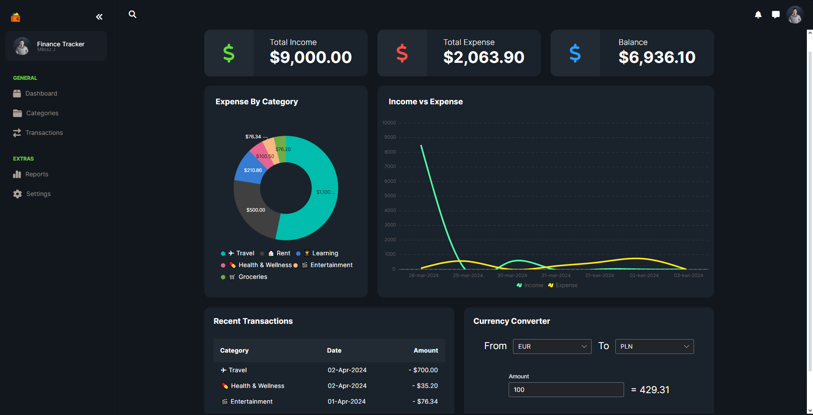
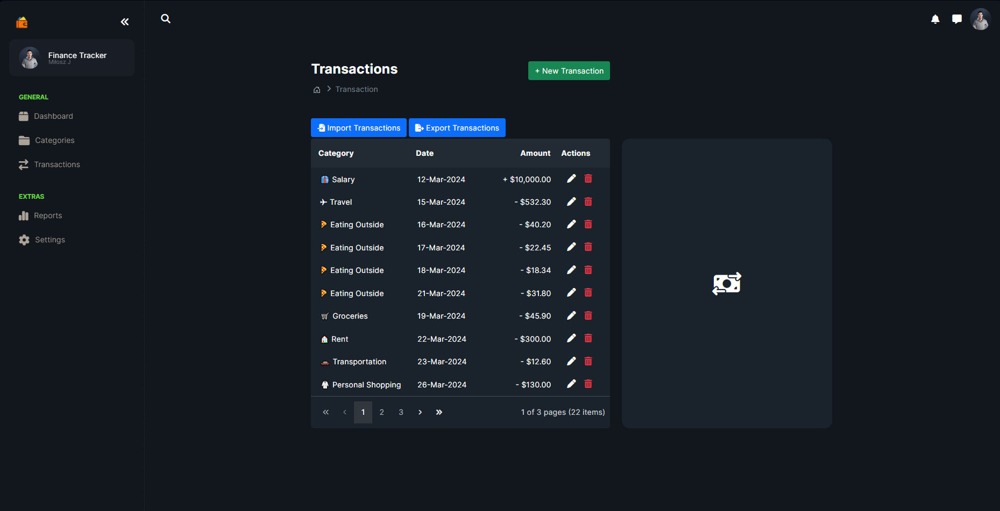
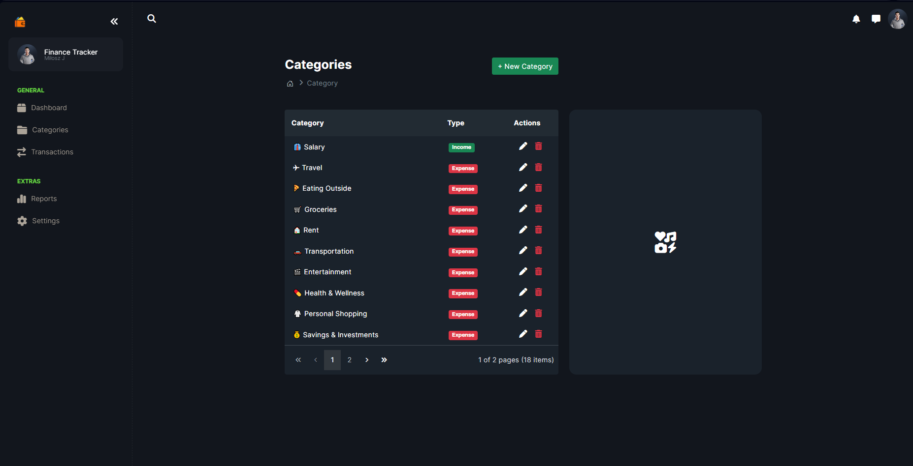

# Finance Tracker

Finance Tracker is a comprehensive web application developed using ASP .NET Core, designed to help users manage their financial transactions effectively. This application offers a range of features aimed at providing users with insights into their financial health, enabling better financial planning and management.

## Features

Finance Tracker offers a suite of features, including:

- **Transaction Categories Management**: Users can add, edit, and delete categories for their transactions, allowing for better organization and tracking of expenses and incomes.

- **Transactions Management**: The application enables users to add, edit, and delete transactions. Each transaction can be categorized for easier management and reporting.

- **Dashboard Overview**: The Dashboard provides users with a summary of their earnings, expenses, and account balance over the last week. It includes visually appealing charts for "Expense By Category" and "Income vs Expense," offering users a quick glance at their financial situation.

- **Recent Transactions Table**: The Dashboard also features a table of recent expenses, giving users an immediate view of their latest financial activities.

- **Currency Converter**: A unique feature of the Finance Tracker is its currency converter, which fetches real-time currency exchange rates from the [Currency Rates API](https://kurs-walut.info/pages/api). This tool is particularly useful for users dealing with transactions in multiple currencies.

- **Import and Export Transactions**: Finance Tracker supports importing and exporting transactions, enabling users to manage their data more efficiently and share it across different platforms or for backup purposes.

## Screenshots from the application

## Technologies Used

- **ASP .NET Core**: Powers the backend services, ensuring fast, reliable, and secure handling of data.
- **Entity Framework Core**: Utilized for database operations to manage data efficiently and robustly.
- **JavaScript** and **CSS**: Enhance the frontend, creating a dynamic and responsive user interface.
- **Bootstrap**: Used for designing a clean and mobile-responsive layout.
- **Syncfusion**: Provides a comprehensive suite of UI components for .NET (ASP.NET Core), including grids, charts, and other UI elements, which significantly improve the application's interactivity and user experience.
